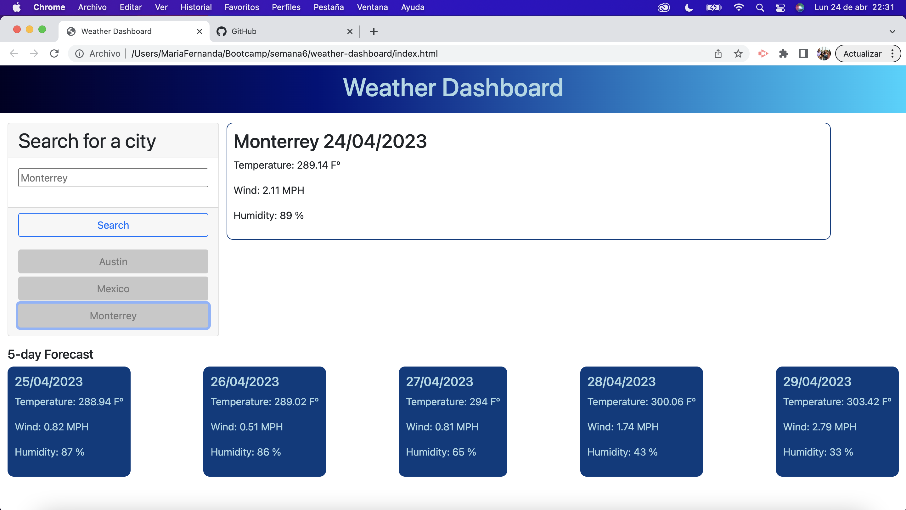

# 06 Server-Side APIs: Weather Dashboard

## The Task

This weather dashboard displays the weather information of a city (user input) of the current day and the forecast of the next five days. The latest searches of the users are stored in local storage and displayed as buttons, so the user can see the information of a city previously searched. 

## User Story

```
AS A traveler
I WANT to see the weather outlook for multiple cities
SO THAT I can plan a trip accordingly
```

## Mock-Up

The following image shows the web application's appearance and functionality:

Initial Page - No searches yet. 


First Search


Lastest searches made by the user



Deployed application: https://mariafernandamarroquin.github.io/weather-dashboard/

GitHub Repository: https://github.com/MariaFernandaMarroquin/weather-dashboard

- - -
© 2023 edX Boot Camps LLC. Confidential and Proprietary. All Rights Reserved.
